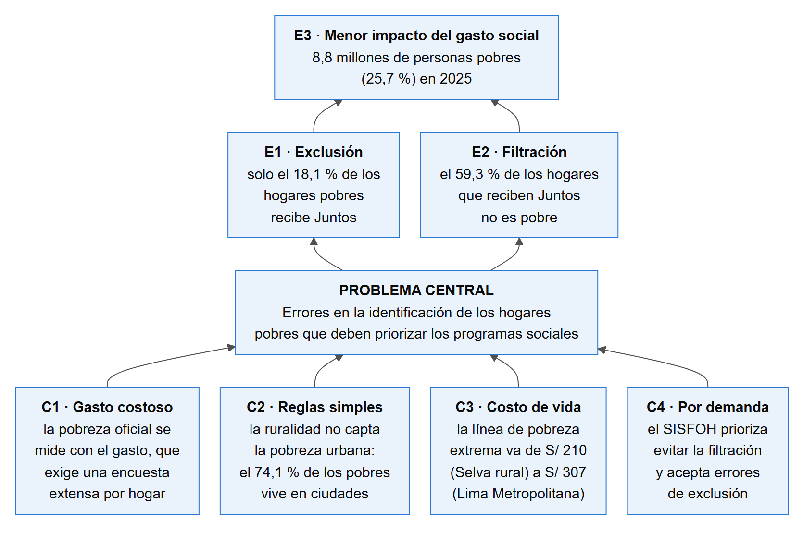
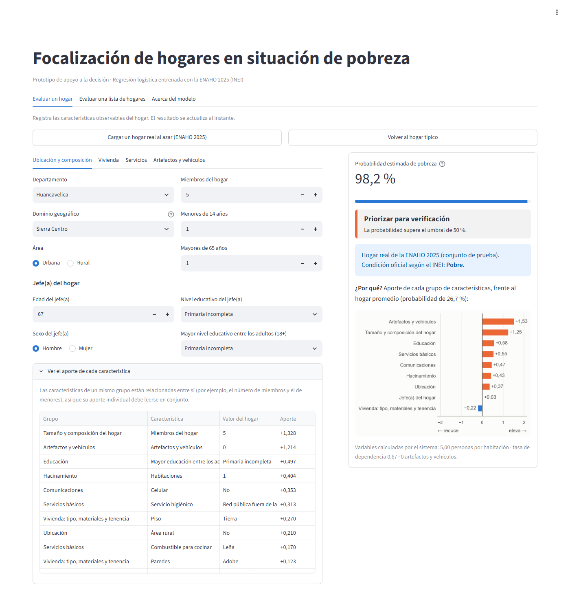
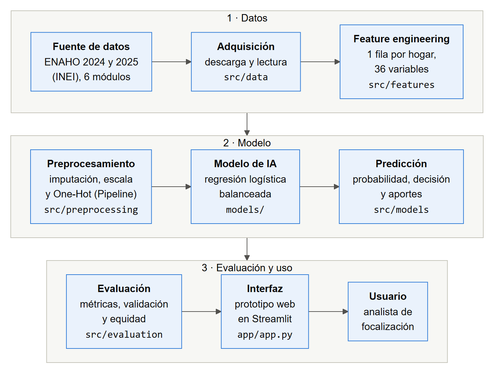

# Identificación de hogares en situación de pobreza monetaria con aprendizaje automático

**Sistema inteligente para apoyar la focalización de programas sociales en el Perú, con datos reales de la ENAHO 2024–2025 (INEI).**

Proyecto de investigación del curso de **Inteligencia Artificial**, Ingeniería Informática, Universidad Nacional Federico Villarreal.
Autor: Nina Anchapuri Brens Fabrizio Leandro · Docente: Rodríguez Rodríguez, Ciro · Septiembre de 2026.

- **Paper completo:** [`paper/paper.pdf`](paper/paper.pdf)
- **Prototipo:** [`app/app.py`](app/app.py) (Streamlit)
- **Cuadernos:** [`notebooks/`](notebooks/), uno por fase de CRISP-DM

---

## 1. ¿Cuál es el problema?

En 2025, la pobreza monetaria afectó al **25,7 %** de la población peruana: **8,8 millones de personas**, 5,5 puntos más que antes de la pandemia (INEI). Programas como Juntos y Pensión 65 deben identificar qué hogares son pobres. Pero la pobreza oficial se mide con el **gasto del hogar**, y medirlo exige una encuesta extensa que no puede aplicarse a cada hogar que solicita un programa.

Por eso la focalización usa características observables y reglas simples, que producen **errores de exclusión** (hogares pobres que quedan fuera) y **de inclusión** (hogares no pobres que reciben el beneficio). Algunas cifras que lo muestran:

| Evidencia | Valor | Fuente |
|---|---|---|
| Pobres que viven en zonas urbanas | 74,1 % | INEI, 2026 |
| Hogares que reciben Juntos y no son pobres | 59,3 % | ENAHO 2025 (cuaderno 02) |
| Hogares pobres que reciben Juntos | 18,1 % | ENAHO 2025 (cuaderno 02) |
| Hogares pobres que la regla «rural = pobre» deja fuera | 51,6 % | Conjunto de prueba (cuaderno 05) |

Además, los estudios peruanos que aplican aprendizaje automático a la ENAHO reportan exactitudes cercanas al 98 %, pero al menos dos de ellos usan el gasto del hogar como predictor. El gasto es justamente la variable con la que se define la pobreza, así que esos modelos no pueden usarse para focalizar (*data leakage*).



## 2. ¿Cuál es el objetivo?

**Objetivo general:** desarrollar un sistema inteligente basado en aprendizaje automático que identifique hogares en situación de pobreza monetaria a partir de características observables, utilizando datos reales de la ENAHO del INEI, con la finalidad de apoyar la focalización de programas sociales en el Perú.

**Pregunta de investigación:** ¿en qué medida un modelo de aprendizaje automático entrenado con características observables del hogar identifica a los hogares pobres mejor que una regla de focalización simple?

| Objetivo específico | Dónde se cumple |
|---|---|
| OE1. Analizar las características asociadas a la pobreza | `01_data_understanding`, `02_eda` |
| OE2. Preparar los datos sin fuga de información | `03_preprocessing` |
| OE3. Implementar regresión logística, árbol de decisión, KNN y Random Forest | `04_modeling` |
| OE4. Evaluar con métricas apropiadas, en prueba y en otro año | `05_evaluation` |
| OE5. Comparar y seleccionar el mejor modelo | `04_modeling`, `05_evaluation` |
| OE6. Implementar un prototipo funcional | `app/app.py`, `tests/` |

## 3. ¿Qué dataset se utilizó?

La **Encuesta Nacional de Hogares (ENAHO)** del INEI, la fuente oficial con la que el Perú mide la pobreza:

| Característica | Descripción |
|---|---|
| Fuente | INEI, [portal de microdatos](https://proyectos.inei.gob.pe/microdatos/) |
| Periodo | ENAHO 2025 (principal) y ENAHO 2024 (validación temporal) |
| Registros | 33 702 hogares (2025) y 33 691 hogares (2024) |
| Unidad de análisis | Hogar |
| Variables | 36 características observables: vivienda, servicios, bienes, composición del hogar, educación y ubicación |
| Variable objetivo | `pobre` = 1 si el INEI clasifica al hogar como pobre (extremo o no extremo); 18,1 % de los hogares |
| Excluidas a propósito | Ingresos, gastos, líneas de pobreza y programas sociales (evitan la fuga de información) |
| Licencia | Microdatos anónimos de acceso libre, protegidos por el secreto estadístico; uso permitido citando la fuente |

**Procedencia verificada:** con los microdatos se reproducen **exactamente** las cifras oficiales de pobreza del INEI: 25,7 % nacional, 23,4 % urbana y 35,5 % rural en 2025, y 27,6 % en 2024. El diccionario de datos completo está en [`docs/diccionario_datos.csv`](docs/diccionario_datos.csv).

## 4. ¿Cómo obtener los datos?

Los datos originales (más de 300 MB) **no se versionan**. Se descargan automáticamente desde el INEI:

```bash
python src/data/descargar.py
```

El cuaderno `01_data_understanding.ipynb` descarga y construye también la ENAHO 2024 (validación temporal). Para descargarla por separado:

```bash
python -c "from src.data.descargar import descargar_enaho; descargar_enaho(2024, modulos=['01','02','03','18','34'])"
```

Los datasets procesados (`data/processed/`) sí están en el repositorio: con ellos funcionan los cuadernos 04 y 05, las pruebas y el prototipo sin descargar nada. Los cuadernos 01 a 03 también leen módulos originales; si aún no están en `data/raw/`, los descargan por su cuenta. Más detalles en [`data/README.md`](data/README.md).

## 5. ¿Cómo instalar el proyecto?

Requisitos: **Python 3.10** (probado con 3.10.6 en Windows 11) o Google Colab.

```bash
git clone https://github.com/BrensNina/proyecto-pobreza-ia.git
cd proyecto-pobreza-ia
pip install -r requirements.txt
```

`requirements.txt` fija las versiones exactas: pandas 2.3.3, numpy 2.2.6, scikit-learn 1.7.2, matplotlib 3.10.9, seaborn 0.13.2, joblib 1.6.0, streamlit 1.64.0 y pytest 9.1.1.

**En Google Colab:** sube la carpeta del proyecto a `MyDrive/proyecto-pobreza-ia` y abre los cuadernos. La primera celda de cada cuaderno monta Google Drive y se ubica en esa carpeta. Para usar las mismas versiones de las librerías, ejecuta antes `!pip install -r /content/drive/MyDrive/proyecto-pobreza-ia/requirements.txt` y reinicia la sesión.

## 6. ¿Cómo ejecutar el código?

El proyecto sigue CRISP-DM. Cada fase es un cuaderno que usa el código de `src/`:

| Cuaderno | Fase | Qué hace |
|---|---|---|
| `01_data_understanding.ipynb` | Comprensión de los datos | Descarga, verificación con las cifras oficiales, construcción de los datasets de 2025 y 2024, calidad de datos |
| `02_eda.ipynb` | Análisis exploratorio | Relación de cada característica con la pobreza; evidencia de errores de focalización |
| `03_preprocessing.ipynb` | Preparación | Selección de variables, pipeline, partición y prevención de *data leakage* |
| `04_modeling.ipynb` | Modelado | Baseline, cuatro algoritmos con `GridSearchCV` y selección |
| `05_evaluation.ipynb` | Evaluación | Prueba, umbral, validación temporal, interpretabilidad, equidad y modelo final |

Los cuadernos ya están guardados con sus salidas, así que pueden leerse sin ejecutarlos. Para ejecutarlos, ábrelos en orden con Jupyter o Colab.

**Pruebas automatizadas:**

```bash
pytest
```

Son 51 pruebas: 29 unitarias, 10 de integración, 6 de validación del modelo con la ENAHO real y 6 funcionales del prototipo. Todas pasan.

## 7. ¿Cómo entrenar el modelo?

El entrenamiento está en `notebooks/04_modeling.ipynb`:

1. Carga la partición guardada (80 % entrenamiento / 20 % prueba, estratificada, semilla 42).
2. Para cada algoritmo, busca hiperparámetros con `GridSearchCV` y validación cruzada de 5 particiones, usando F1 como criterio.
3. Guarda cada pipeline completo (preprocesamiento + modelo) en `models/`.

El modelo final (regresión logística con `C=1` y `class_weight="balanced"`) se guarda en `notebooks/05_evaluation.ipynb` como `models/modelo_final.joblib` (9 KB), junto con `models/modelo_final_metadatos.json`. Los modelos pesados de KNN y Random Forest no se versionan: se regeneran ejecutando el cuaderno 04.

## 8. ¿Cómo reproducir los experimentos?

1. Instala las dependencias (sección 5).
2. Descarga los datos (sección 4) o usa los procesados del repositorio.
3. Ejecuta los cuadernos 01 a 05 en orden. Regeneran el dataset, la partición, los modelos, las tablas (`results/tablas/`) y las figuras (`results/figuras/`).
4. Ejecuta `pytest`. Las pruebas de `tests/test_validacion_modelo.py` comprueban que el modelo guardado reproduce las métricas reportadas.

La configuración común (semilla, proporción de prueba, rutas) está en [`src/config.py`](src/config.py).

| Experimento | Modelo | Pregunta |
|---|---|---|
| E0 | Regla «rural = pobre» (baseline sin IA) | ¿Cuánto se logra sin IA? |
| E1 | Regresión logística por defecto | ¿Cuánto aporta un modelo sin ajustar? |
| E2 | Regresión logística ajustada | ¿Cuál es el mejor modelo lineal? |
| E3 | Árbol de decisión | ¿Ayudan las reglas no lineales? |
| E4 | KNN | ¿Sirve la similitud entre hogares? |
| E5 | Random Forest | ¿Mejora un ensamble no lineal? |
| E6 | E2 y E5 entrenados con 2024 | ¿Generaliza a otro año? |

## 9. ¿Cómo ejecutar el prototipo?

Desde la raíz del proyecto:

```bash
streamlit run app/app.py
```

Se abre en el navegador (`http://localhost:8501`) con tres pestañas:

- **Evaluar un hogar:** una ficha con las características del hogar. Muestra la probabilidad de pobreza, la decisión (priorizar o no) y **por qué**, con el aporte de cada grupo de características. Un botón carga un hogar real de la ENAHO y muestra su condición oficial, para comparar.
- **Evaluar una lista de hogares:** ordena de mayor a menor riesgo un CSV propio o una muestra real de 300 hogares, y permite descargar el resultado.
- **Acerca del modelo:** desempeño, equidad por grupo, limitaciones y uso responsable.



## 10. ¿Cuáles fueron los resultados?

**En el conjunto de prueba (6 741 hogares nunca usados antes):**

| Modelo | F1 | Precision | Recall | ROC-AUC |
|---|---|---|---|---|
| Regla «rural = pobre» (sin IA) | 0,334 | 0,255 | 0,484 | – |
| **Regresión logística (modelo final)** | **0,544** | 0,413 | **0,798** | **0,853** |
| Random Forest | 0,549 | 0,455 | 0,691 | 0,849 |
| Árbol de decisión | 0,495 | 0,367 | 0,759 | 0,808 |
| KNN | 0,406 | 0,466 | 0,360 | 0,724 |

- **La IA supera a la regla en los dos errores a la vez:** detecta 383 hogares pobres más (974 frente a 591) e incluye por error a 336 hogares no pobres menos (1 387 frente a 1 723).
- **Generaliza a otro año:** entrenado con la ENAHO 2024 y evaluado con hogares nuevos de 2025, mantiene un F1 de 0,544.
- **Regresión logística y Random Forest empatan.** Por la regla de selección fijada de antemano, se eligió la regresión logística: es interpretable, deja fuera a menos pobres, no sobreajusta y pesa 9 KB (frente a 63 MB).
- **Lo que más pesa en la decisión:** el tamaño del hogar, los bienes durables, el hacinamiento, la vivienda, la educación y la ubicación. La ubicación refleja el costo de vida: el INEI usa líneas de pobreza distintas por dominio.
- **Brechas de equidad:** el modelo detecta al 72,5 % de los hogares pobres urbanos (frente al 87,5 % de los rurales), al 73,3 % de los hogares con jefa mujer (frente al 83,2 % con jefe hombre) y solo al 54,8 % en la Costa Sur.

**Uso responsable:** es una herramienta de **apoyo a la decisión**, para ordenar y priorizar la verificación de hogares. No reemplaza la clasificación socioeconómica oficial, y no debe usarse para excluir hogares de forma automática.

---

## Estructura del repositorio

```
proyecto-pobreza-ia/
├── README.md               Este archivo
├── LICENSE                 Licencia MIT
├── requirements.txt        Dependencias con versiones exactas
├── pytest.ini              Configuración de las pruebas
├── data/
│   ├── raw/                Datos originales del INEI (se descargan, no se versionan)
│   ├── processed/          Datasets de hogares 2024 y 2025, partición y marca de panel
│   └── README.md           Origen, formato y cómo obtener los datos
├── notebooks/              01 a 05, una fase de CRISP-DM cada uno (con salidas)
├── src/
│   ├── data/               Descarga y lectura de la ENAHO
│   ├── features/           Construcción del dataset y variables derivadas
│   ├── preprocessing/      Pipeline de preprocesamiento y partición
│   ├── models/             Modelos, grillas, baseline y predicción
│   ├── evaluation/         Métricas e interpretación
│   ├── config.py           Semilla, proporciones y rutas
│   └── visualizacion.py    Estilo común de los gráficos
├── app/app.py              Prototipo en Streamlit
├── tests/                  51 pruebas con pytest
├── models/                 Modelo final (.joblib) y sus metadatos (.json)
├── results/                Tablas (CSV) y figuras (PNG) de los cuadernos
├── docs/
│   ├── diccionario_datos.csv
│   ├── diagramas/          Diagramas UML y de arquitectura (fuentes Mermaid .mmd y PNG)
│   └── capturas/           Capturas del prototipo
└── paper/paper.pdf         Artículo completo (PDF)
```

## Arquitectura y diseño



Los diagramas UML (casos de uso, componentes, secuencia), la arquitectura y el diseño experimental están en [`docs/diagramas/`](docs/diagramas/). Las fuentes están en Mermaid (`.mmd`), y se pueden editar en [mermaid.live](https://mermaid.live).

## Documentación

- [`paper/paper.pdf`](paper/paper.pdf): artículo completo.
- [`data/README.md`](data/README.md): detalle de los datos.

## Licencia y fuente de los datos

El código se distribuye con licencia **MIT** ([`LICENSE`](LICENSE)). Los datos pertenecen al **Instituto Nacional de Estadística e Informática (INEI)** y se usan citando la fuente: *INEI, Encuesta Nacional de Hogares (ENAHO) 2024 y 2025, microdatos*.
